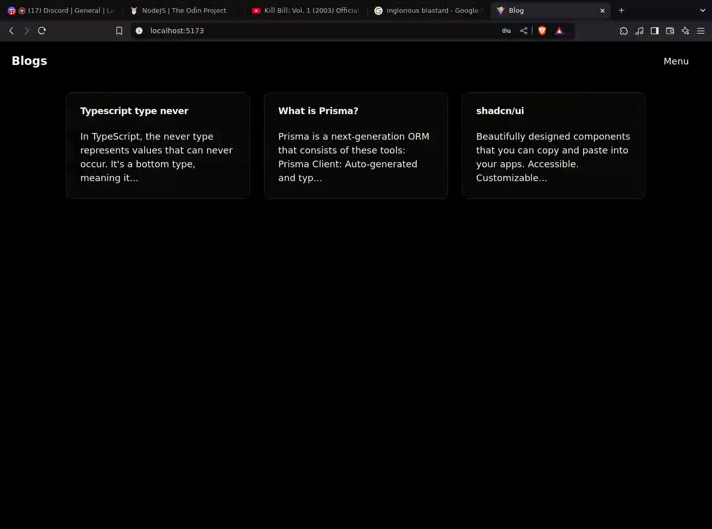

# Blog API

This is a simple blog website using a REST API with separate front end and back end apps. The frontend uses React + Vite and Shadcn, while maintaining a JWT sent from the backend to authenticate users. The backend uses Nodejs, Typescript, Passport, and jsonwebtoken.

A demo of the app can be seen below:

